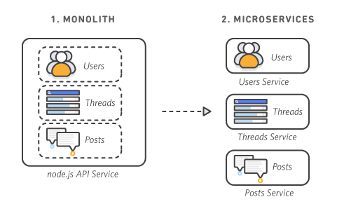

 # SORULARA CEVAPLAR

## Senkron ve Asenkron iletişim nedir örneklerle açıklayın? (10 PUAN)


Bilgi teknolojileri dünyasında, senkron ve asenkron iletişim terimleri, bilgisayarlar arasındaki veri transferi ve iletişim süreçlerini tanımlamak için kullanılır. Bu terimler, bilgi teknolojileri ve programlama alanlarında farklı bağlamlarda karşımıza çıkar.

### Senkron İletişim:
Bilgisayar ağlarındaki zamanlanmış veri transferinde sıkça kullanılır. Örneğin, bir ağdaki cihazlar belirli bir saat diliminde veri paketlerini alışveriş ederler. Zamanlama protokolleri, veri iletimini düzenlemek için kullanılır. Örneğin, Zaman Bölümlü Çoklama (TDM) telekomünikasyon ağlarında senkronize iletişim için kullanılır.

### Asenkron İletişim:
İnternet ve bilgisayar ağlarındaki iletişimde yaygın olarak kullanılır. Veri transferi belirli bir zaman dilimine bağlı olmadan gerçekleşir. Örneğin, e-posta iletişimi asenkron bir iletişim biçimidir. İletilen mesajlar, alıcının hazır olduğu herhangi bir zamanda gönderilir ve alınır. Ayrıca, web tarayıcıları ile sunucular arasındaki HTTP istekleri ve yanıtlar da asenkron olarak gerçekleşebilir.

### Senkron Programlama:
Bir çoklu iş parçacığı veya işlem tarafından paylaşılan kaynaklara erişimi senkronize etmek için kullanılır. Örneğin, bir veritabanına erişirken senkronize işlem yapmak için senkronizasyon teknikleri kullanılabilir.

### Asenkron Programlama:
Web geliştirme alanında yaygın olarak kullanılır. Örneğin, JavaScript'te asenkron işlevler, web sayfalarının dinamik olarak güncellenmesi ve kullanıcı etkileşimlerinin işlenmesi için kullanılır. Bir kullanıcının web sayfasındaki bir düğmeye tıklamasıyla tetiklenen bir HTTP isteği, asenkron olarak sunucuya gönderilir ve sunucudan gelen yanıt beklenir. Bu süreç, kullanıcının diğer işlemlerle etkileşime girmesine izin verirken arka planda işlem yapılmasını sağlar.

#### Senkron İletişim Örnekleri:

- Telekomünikasyon ağlarında kullanılan Zaman Bölümlü Çoklama (TDM) protokolü.
- Ethernet ağlarında kullanılan Token Ring protokolü.

#### Asenkron İletişim Örnekleri:

- E-posta iletişimi.
- Web tarayıcıları ve sunucular arasındaki HTTP istekleri ve yanıtları.
- USB ile bağlı cihazlar arasındaki veri iletimi.

#### Senkron Programlama Örnekleri:

- Birden fazla iş parçacığı veya işlem tarafından paylaşılan kaynaklara erişimi senkronize etmek için kullanılan senkronizasyon teknikleri.

#### Asenkron Programlama Örnekleri:

- Web geliştirme alanında kullanılan JavaScript'te asenkron işlevler.
- Kullanıcı etkileşimlerini işlemek için kullanılan asenkron HTTP istekleri ve yanıtları.

## RabbitMQ ve Kafka arasındaki farkları araştırın? (10 PUAN)

**Kafka ve RabbitMQ, birer mesaj kuyruğu sistemleridir. Yüksek akışlı veri akışlarını sürekli ve hatasız bir biçimde yapmayı amaçlar.** 

RabbitMQ, birden fazla kaynaktan verileri toplayıp farklı hedeflere yönlendirir. Kafka ise, gerçek zamanlı veri hattı ve akış oluşturmaya yönelik açık kaynaklı bir platformdur. Kafka, RabbitMQ'ya göre daha dayanıklı ve hataya olanaksız bir mesajlaşam sistemi sağlar.


İkisi de veri akışını işlemek için kullanılır, ancak mimari yapıları ve işleyişleri farklıdır.

### RabbitMQ:

- Genel amaçlı bir mesaj aracısıdır.
- Üreticiler mesaj gönderir, aracı bu mesajları yönlendirir ve tüketiciler alır.
- Mesajları sıraya alır ve tüketicilere iletilir.
- Mesajların silinmesi, tüketilmesi ve önceliklendirilmesi gibi özellikleri destekler.

### Kafka:

- Gerçek zamanlı veri hatları ve akış uygulamaları oluşturmak için kullanılan bir platformdur.
- Üreticiler mesajları yayınlar, tüketiciler ise bu mesajları okur.
- Mesajları saklama politikası doğrultusunda günlük dosyalarında saklar.
- Mesaj önceliği kavramını desteklemez.

Farklı kullanım durumlarına göre tercih edilirler. Örneğin, RabbitMQ, esnek yönlendirme ve mesaj önceliği gibi gereksinimleri olan uygulamalar için uygundur. Kafka ise gerçek zamanlı veri işleme ve yüksek performanslı iletişim gerektiren uygulamalar için idealdir.


## Docker ve Virtual Machine nedir? (5 PUAN)

### Docker:

**Docker, uygulamaları container adı verilen standart birimler halinde paketlemek ve çalıştırmak için kullanılan açık kaynaklı bir platformdur.**

- Docker, uygulamaları bağımsız, izole ve hafif container'lar içinde çalıştırır.
- Her bir Docker container'ı, uygulama kodunu, bağımlılıkları, sistem araçlarını ve çalışma zamanını içerir.
- Docker container'ları, işletim sistemi seviyesinde sanallaştırma sağlar ve hızlı dağıtım döngüleri için idealdir.
- Uygulamaları herhangi bir ortamda tutarlı bir şekilde çalıştırabilmek için Docker, işletim sistemlerindeki farklılıkları soyutlar.
- Docker, Dockerfile ve Docker Compose gibi araçlar aracılığıyla uygulama dağıtımını ve yönetimini kolaylaştırır.

### Sanal Makineler (VM'ler):

**Sanal makine, fiziksel bir makinenin dijital bir kopyasıdır ve her biri kendi işletim sistemine sahiptir.**

- Sanal makineler, fiziksel donanım kaynaklarını sanallaştırarak birden fazla işletim sistemi çalıştırmayı sağlar.
- Her bir sanal makine, kendi işletim sistemi, dosya sistemi ve ağ yapılandırmasıyla tamamen izole bir ortam sağlar.
- Sanal makineler, farklı işletim sistemlerini çalıştırmak, güvenlik gereksinimlerini karşılamak ve donanım kaynaklarını etkili bir şekilde paylaşmak için kullanılır.
- Sanal makineler, hipervizör yazılımı aracılığıyla ana bilgisayar üzerinde çalışır ve genellikle daha fazla kaynak tüketir.

### Docker ve Sanal Makine (VM) Farkı:

**Docker, uygulamaları container'lar içinde çalıştırırken, sanal makineler fiziksel bir makinenin dijital bir kopyasıdır ve her biri kendi işletim sistemine sahiptir.**

## Docker komutlarını örneklerle açıklayın. (5 PUAN)


Docker'da sık kullanılan bazı komutlar şunlardır:


### docker run

Docker container'ını çalıştırmak için kullanılır.

#### Örnek:

```console
docker run -d --name my_container nginx
```
Bu komut, "nginx" adlı Docker imajından bir container oluşturur ve adını "my_container" olarak belirler. Oluşturulan container arka planda çalışır.

### docker ps
Çalışan Docker container'larını listeler.

#### Örnek:

```console
docker ps
```
Bu komut, çalışan container'ları listeler ve bunlar hakkında temel bilgileri (ID, isim, durum, vs.) gösterir.

### docker stop
Çalışan bir Docker container'ını durdurmak için kullanılır.

#### Örnek:

```console
docker stop my_container
```
Bu komut, "my_container" adlı container'ı durdurur.

### docker rm
Bir Docker container'ını silmek için kullanılır.

#### Örnek:

```console
docker rm my_container
```
Bu komut, "my_container" adlı container'ı siler.

### docker pull
Docker imajını indirmek için kullanılır.

#### Örnek:

```console
docker pull ubuntu
```
Bu komut, "ubuntu" adlı Docker imajını indirir.

### docker build
Docker imajını oluşturmak için kullanılır.

#### Örnek:

```console
docker build -t my_image .
```
Bu komut, mevcut dizindeki Dockerfile kullanılarak "my_image" adında bir Docker imajı oluşturur.

Bu komutlar, Docker'ın temel işlevlerini gerçekleştirmek için kullanılır ve Docker'ın birçok özelliğini keşfetmek için başlangıç noktası sağlar.

## Microservice ve Monotlith mimarilerini kıyaslayın. (15 PUAN)

**Tek parça uygulama mimarisi, bir kod tabanı içinde birden fazla işlevi gerçekleştiren ve genellikle tek bir sunucuda çalışan yazılımların geleneksel bir mimarisidir. Mikro hizmetler mimarisi ise, yazılımı bağımsız hizmetlere bölen ve her bir hizmetin tek bir işlevi gerçekleştirdiği bir mimaridir**. İşte bu iki yaklaşım arasındaki farklar:

### Monolitik Uygulama Mimarisi:

- Bir kod tabanı içinde birden fazla işlevi gerçekleştirir.
- Tüm yazılım bileşenleri birbiriyle sıkı bir şekilde bağlantılıdır.
- Küçük değişikliklerin tüm kod tabanını etkileme olasılığı yüksektir.
- Tüm uygulama tek bir varlık olarak dağıtılır.
- Hata ayıklama genellikle aynı ortamda yapılır.
- Ölçeklendirme genellikle tüm uygulamayı ölçeklendirme gerektirir.
- Yatırım genellikle düşük ön yatırım gerektirir ancak bakım ve geliştirme süreçleri zamanla karmaşıklaşabilir.

### Mikro Servisler Mimarisi:

- Yazılımı bağımsız hizmetlere böler ve her bir hizmet tek bir işlevi gerçekleştirir.
- Her hizmet bir API üzerinden diğer hizmetlerle iletişim kurar.
- Küçük değişikliklerin sadece ilgili hizmeti etkileme olasılığı yüksektir.
- Her bir hizmet bağımsız olarak dağıtılabilir.
- Hata ayıklama genellikle dağıtılmış bir ortamda yapılır.
- Ölçeklendirme genellikle yalnızca belirli hizmetlerin ölçeklendirilmesini gerektirir.
- Yatırım genellikle başlangıçta daha fazla zaman ve maliyet gerektirir ancak uzun vadede bakım ve geliştirme süreçleri daha etkin hâle gelir.
- Bu farklar göz önüne alındığında, bir organizasyonun uygulama ihtiyaçlarına ve geliştirme ekibinin yeteneklerine bağlı olarak tek parça uygulama mimarisi veya mikro hizmetler mimarisi tercih edilebilir.



## API Gateway, Service Discovery, Load Balancer kavramlarını açıklayın. (10 PUAN)


### **API Gateway:**

API Gateway, bir yazılım uygulamasının dış dünya ile iletişimini yöneten bir servistir. Temel olarak, bir uygulamanın sunduğu işlevleri dışarıya sunar ve dış dünyadan gelen istekleri doğru hizmetlere yönlendirir. API Gateway, gelen istekleri doğrulayabilir, yetkilendirebilir, izleyebilir ve hata durumlarında uygun yanıtlar sağlayabilir.

API Gateway'in temel fonksiyonları şunlardır:

**API Yönetimi:** API Gateway, birden fazla mikro hizmetin API'sini tek bir yerden yönetmeyi sağlar. API'lerin versiyon kontrolü, belgelendirme, sürümleme gibi işlevleri API Gateway üzerinden yönetilebilir.

**Güvenlik ve Kimlik Doğrulama:** API Gateway, gelen istekleri doğrulayabilir ve yetkilendirebilir. OAuth, JWT, API anahtarı gibi kimlik doğrulama mekanizmalarını destekler.

**Trafiği Yönlendirme:** Gelen istekleri, belirli hizmetlere veya arka uçlara yönlendirir. Örneğin, farklı URL rotalarına gelen istekleri belirli mikro hizmetlere yönlendirebilir.

**İzleme ve Analiz:** API Gateway, gelen ve giden trafiği izleyebilir ve analiz edebilir. Bu, performans sorunlarını belirlemek, API kullanımını anlamak ve hataları izlemek için önemlidir.

API Gateway, mikro hizmet mimarisi gibi dağıtılmış sistemlerin dış dünya ile etkileşimini basitleştirmek ve yönetmek için yaygın olarak kullanılır.

### **Service Discovery:**

Service Discovery, bir dağıtılmış uygulama içindeki hizmetlerin dinamik olarak bulunmasını ve birbirleriyle iletişim kurmasını sağlayan bir mekanizmadır. Dağıtılmış sistemlerde, hizmetlerin IP adresleri ve bağlantı noktaları sıklıkla değişebilir ve yeni hizmetler eklenebilir veya mevcut hizmetler kaldırılabilir. Bu nedenle, hizmetlerin birbirlerini dinamik olarak bulması ve iletişim kurması gereklidir.

Service Discovery'nin temel fonksiyonları şunlardır:

**Hizmet Kaydı:** Hizmetlerin kendilerini Service Discovery sunucusuna kaydetmesi ve bilgilerini güncellemesi. Bu bilgiler genellikle hizmetin adı, IP adresi, bağlantı noktası ve diğer ilgili meta verileri içerir.

**Hizmet Bulma:** İstemcilerin Service Discovery sunucusundan belirli bir hizmeti bulmasını ve hizmetin konumunu ve bağlantı noktasını almasını sağlar.

**Hizmetler Arası İletişim:** Hizmetler, Service Discovery mekanizması aracılığıyla diğer hizmetlere dinamik olarak bağlanabilir ve iletişim kurabilir.

Service Discovery, özellikle bulut tabanlı, dinamik olarak ölçeklendirilen ve dağıtılmış sistemlerde yaygın olarak kullanılır.

### **Load Balancer:**

Load Balancer, bir ağdaki veya bir sunucu kümesindeki yükü dengeler ve gelen istekleri farklı sunuculara dağıtarak performansı artırır ve yükü paylaşır. Load Balancer, bir sunucunun aşırı yüklenmesini önler ve yüksek erişilebilirlik ve dayanıklılık sağlar.

Load Balancer'ın temel fonksiyonları şunlardır:

**Yük Dengesi:** Gelen istekleri farklı sunuculara dağıtarak yükü dengeler.

**Yüksek Erişilebilirlik:** Sunucu arızaları veya bakım durumlarında hizmetin kesintisiz olarak devam etmesini sağlar.


## Hibernate, JPA, Spring Data framework’lerini örneklerle açıklayın. (10 PUAN)

### Hibernate:

Hibernate, Java platformu için bir ORM (Object-Relational Mapping) çerçevesidir. Veritabanı tablolarını ve nesne modellerini eşleştirmeye olanak tanır, böylece Java uygulamaları için veritabanı işlemlerini kolaylaştırır. Hibernate, veritabanı bağlantısını yönetir, sorguları oluşturur, sonuçları nesne grafiklerine dönüştürür ve veritabanına değişiklikleri kaydeder.

Örnek bir Hibernate kullanımı:

```java
@Entity
@Table(name = "employees")
public class Employee {
    @Id
    @GeneratedValue(strategy = GenerationType.IDENTITY)
    private Long id;
    
    @Column(name = "first_name")
    private String firstName;
    
    @Column(name = "last_name")
    private String lastName;
    
    // Getters and setters
}

// Hibernate SessionFactory oluşturma
SessionFactory sessionFactory = new Configuration().configure().buildSessionFactory();

// Session oluşturma
Session session = sessionFactory.openSession();

// Veri tabanına kaydetme
Transaction transaction = session.beginTransaction();
Employee employee = new Employee();
employee.setFirstName("John");
employee.setLastName("Doe");
session.save(employee);
transaction.commit();

// Session kapatma
session.close();
```

### JPA (Java Persistence API):

JPA, Java platformu için bir ORM standartıdır ve Java EE spesifikasyonunun bir parçasıdır. JPA, Hibernate gibi ORM çerçevelerinin altında çalışır ve standart bir API sağlar. JPA, veritabanı işlemlerini gerçekleştirmek için POJO (Plain Old Java Object) sınıflarını kullanır ve bu sınıfları ilişkisel veritabanı tablolarına eşler.

Örnek bir JPA kullanımı (EntityManager kullanarak):

```java
// EntityManagerFactory oluşturma
EntityManagerFactory entityManagerFactory = Persistence.createEntityManagerFactory("example-unit");

// EntityManager oluşturma
EntityManager entityManager = entityManagerFactory.createEntityManager();

// Veri tabanına kaydetme
entityManager.getTransaction().begin();
Employee employee = new Employee();
employee.setFirstName("Jane");
employee.setLastName("Doe");
entityManager.persist(employee);
entityManager.getTransaction().commit();

// EntityManager kapatma
entityManager.close();
```

### Spring Data:

Spring Data, Spring ekosistemi içinde bulunan ve veritabanı etkileşimlerini kolaylaştıran bir alt projedir. Spring Data, çeşitli veritabanı teknolojileri için genel bir veri erişim katmanı sağlar ve tekrarlayıcı kod miktarını azaltır. Spring Data, JpaRepository gibi arayüzler sağlar ve veritabanı işlemlerini otomatik olarak oluşturur.

Örnek bir Spring Data kullanımı (JpaRepository kullanarak):

```java
public interface EmployeeRepository extends JpaRepository<Employee, Long> {
}

// EmployeeRepository'nin kullanımı
@Service
public class EmployeeService {
    @Autowired
    private EmployeeRepository employeeRepository;
    
    public void saveEmployee(Employee employee) {
        employeeRepository.save(employee);
    }
}
```

Yukarıdaki örneklerde, her bir framework'ün temel kullanımı ve özellikleri gösterilmektedir. Bu örnekler, Hibernate, JPA ve Spring Data'nın nasıl kullanılabileceği konusunda temel bir anlayış sağlar.

